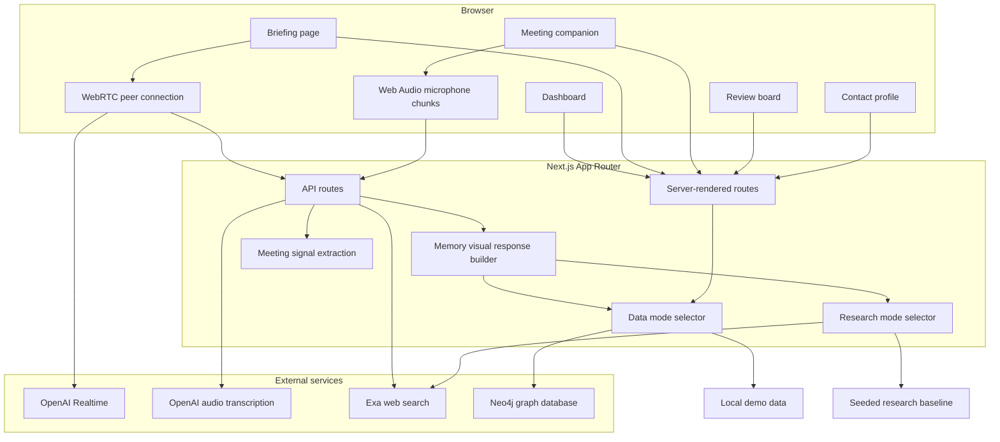
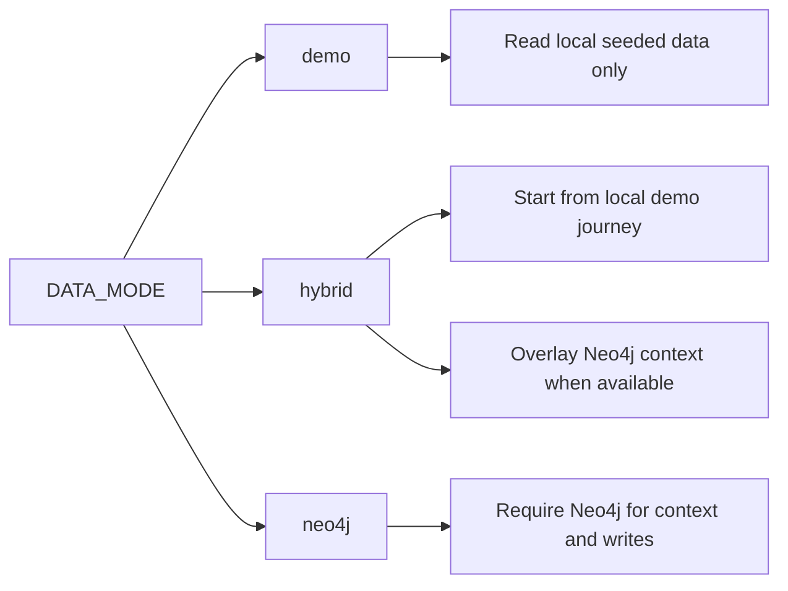
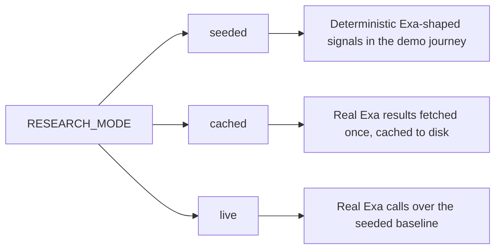
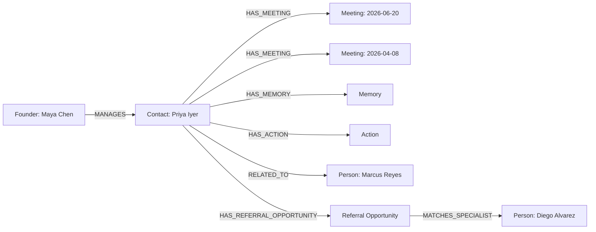
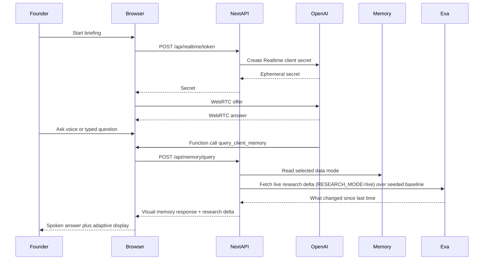
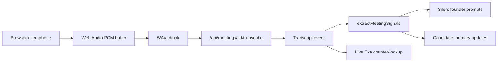

# System Architecture

This document describes the `main` branch architecture for Forebrief.

## Product Shape

Forebrief is a founder relationship operating system — one memory for everyone a founder knows (investors, customers, advisors, candidates). The MVP is organized around one complete relationship loop:

1. **Before the meeting:** prepare the founder with grounded relationship memory fused with live external research (Exa).
2. **During the meeting:** listen silently, suggest useful questions, run live counter-lookups, and capture important signals.
3. **After the meeting:** review suggested follow-ups and memory updates.
4. **Contact memory:** show the saved facts, open concerns, relationships, referral opportunities, and approved updates.

The product is deliberately founder-gated. The system can draft and recommend, but it does not send contact-facing messages from the current approval buttons. Human-in-the-loop governance is a feature, not a limit.

## Runtime Architecture



## Layer Responsibilities

| Layer | Owns | Key Files |
| --- | --- | --- |
| Pages | Route-level product surfaces and data loading. | `app/page.tsx`, `app/briefing/[meetingId]/page.tsx`, `app/meeting/[meetingId]/page.tsx`, `app/post-meeting/[meetingId]/page.tsx`, `app/client/[clientId]/page.tsx` |
| Client components | Interactive voice, meeting capture, review approval, graph and timeline displays. | `components/voice-briefing.tsx`, `components/meeting-companion.tsx`, `components/review-board.tsx`, `components/relationship-graph.tsx`, `components/context-panel.tsx`, `components/timeline.tsx` |
| API routes | Boundary between UI, OpenAI, Exa, Neo4j, and deterministic extraction. | `app/api/**/route.ts` |
| Memory layer | Data-mode selection, Neo4j reads/writes, demo fallback, context generation. | `lib/neo4j-memory.ts`, `lib/demo-data.ts` |
| Live research | Research-mode selection, seeded baseline, cached and live Exa fetches. | `lib/exa-research.ts` |
| Query presentation | Converts a memory query into an answer plus the best visual display shape, fused with a research delta. | `lib/memory-query-response.ts` |
| Types | Shared domain contracts for founders, contacts, meetings, memory, graph, actions, suggestions, research deltas, and visual responses. | `lib/types.ts` |
| Checks and seeders | Verifies data sources, MVP behavior, Neo4j connectivity, and graph seed data. | `scripts/*.ts` |

## Tech Stack

### Application

- **Next.js App Router:** single app for server-rendered pages and route handlers.
- **React 19:** client interactivity for Realtime, mic capture, review state, and adaptive display.
- **TypeScript:** shared domain models across UI, API routes, scripts, and memory logic.
- **Tailwind CSS:** application styling, layout, responsive surfaces, and component variants.
- **lucide-react:** icon system used across buttons, cards, tabs, and workflow markers.

### AI And Voice

- **OpenAI Realtime:** pre-meeting voice briefing over browser WebRTC. The server mints a short-lived client secret through `/api/realtime/token`, then the browser opens a peer connection to OpenAI.
- **OpenAI audio transcription:** live meeting chunks are posted to `/api/meetings/[meetingId]/transcribe`, which forwards audio to OpenAI only when `OPENAI_API_KEY` is present.
- **Deterministic extraction:** `extractMeetingSignals` currently uses known demo patterns to turn transcript events into silent suggestions and memory proposals. This keeps the hackathon demo reliable and easy to inspect.

### Live Research

- **Exa neural web search:** live "what changed since last time" intelligence layered over internal graph memory. `lib/exa-research.ts` chooses behavior from `RESEARCH_MODE` (`seeded`, `cached`, `live`), mirroring the `DATA_MODE` reliability pattern. Seeded intelligence is always layered beneath live research so the same surfaces stay intelligent if a service is down.

### Data

- **Neo4j driver:** reads and writes graph-shaped relationship memory.
- **Local demo data:** deterministic fallback in `lib/demo-data.ts`.
- **Data mode selector:** `lib/neo4j-memory.ts` chooses `demo`, `hybrid`, or `neo4j` behavior.

### Verification

- **ESLint:** static quality check.
- **TypeScript scripts through `tsx`:** smoke checks for data source, MVP route behavior, Neo4j connectivity, graph seeding, and approved-memory persistence.
- **Next build:** production compile check.

## Data Modes

The system uses `DATA_MODE` to make the demo reliable without hiding integration failures.



| Mode | Read Behavior | Write Behavior | Failure Behavior |
| --- | --- | --- | --- |
| `demo` | Reads from `lib/demo-data.ts`. | Approval routes return demo write results when Neo4j is not configured. | UI remains available. |
| `hybrid` | Starts from demo data and overlays Neo4j founder, contact, meeting, memory, action, graph, and briefing data when possible. | Writes to Neo4j when configured, otherwise returns demo result. | Falls back to demo with a warning. |
| `neo4j` | Reads founder, contact, meetings, memories, actions, graph, suggested questions, and briefing from Neo4j. | Writes approved actions and memories to Neo4j. | Fails visibly if Neo4j is missing or invalid. |

If `DATA_MODE` is unset, the app chooses `neo4j` when Neo4j env vars are present and `demo` otherwise.

## Research Modes

Live external intelligence from Exa is controlled by `RESEARCH_MODE`.



| Mode | Behavior | Best For |
| --- | --- | --- |
| `seeded` | Deterministic Exa-shaped signals baked into the demo journey. No Exa key required. | Fast first run and judge fallback. |
| `cached` | Real Exa results fetched once and cached to disk. | Repeatable demos without live network calls. |
| `live` | Real Exa calls, layered over the seeded baseline when configured. | Proof of live external intelligence. |

If `RESEARCH_MODE` is unset or Exa is not configured, the seeded baseline keeps briefings and lookups intelligent.

## Domain Model

Main domain types live in `lib/types.ts`.

Core entities:

- `Founder`: founder identity and company.
- `Contact`: contact identity, type, and relationship context.
- `Meeting`: upcoming or prior meeting.
- `MemoryItem`: remembered facts with category, evidence, confidence, status, salience, and timestamps.
- `ActionItem`: founder follow-up action with owner, due date, status, and optional draft text.
- `GraphNode` and `GraphEdge`: graph display objects for founder, contact, people, partners, opportunities, and referral opportunities.
- `TranscriptEvent`: meeting utterance with speaker label and timestamp.
- `ExtractedMemory`: candidate memory proposal from live meeting signals.
- `ResearchDelta`: live external research (Exa) fused into a query response, with `EvidenceSnippet` entries.
- `MemoryQueryVisualResponse`: normalized L1/L1.5 answer and display payload, including the research delta.

`Advisor` and `Client` are kept as deprecated type aliases of `Founder` and `Contact` for transition; new code uses `Founder`/`Contact`.

Memory categories:

- Life Event
- Emotional Cue
- Unresolved Concern
- Goal/Objective
- Promise/Commitment
- Relationship Mention
- Referral Opportunity
- Follow-Up Action

## Neo4j Memory Shape

The seed script writes a compact graph that mirrors the founder story:



Approved memory writes create:

- A `Memory` node connected to the contact with `HAS_MEMORY`.
- For supported categories, a typed node such as `LifeEvent`, `Concern`, `Objective`, or `Promise`.
- A materialization relationship from the saved memory to the typed node.

The current relationship graph surface reads and displays the founder, contact, people, partners, opportunities, and referral opportunity graph. The typed approved-memory nodes are saved for memory proof and future graph expansion.

## L1: Pre-Meeting Briefing

Route:

```text
/briefing/[meetingId]
```

Core component:

```text
components/voice-briefing.tsx
```

Flow:



Fallbacks:

- If `OPENAI_API_KEY` is missing, the Realtime token route returns demo mode and typed Q&A still works.
- If microphone permission fails, typed questions still call `/api/memory/query`.
- If Neo4j is unavailable in `demo` or `hybrid`, deterministic memory remains available.
- If Exa is unavailable, the seeded research baseline remains available.

## L1.5: Adaptive Memory Display

L1.5 is implemented by `lib/memory-query-response.ts`.

It detects the likely founder intent and returns a normalized payload:

```text
MemoryQueryVisualResponse
```

Display modes:

- `brief`: one concise answer.
- `cards`: memory cards for high-salience facts.
- `table`: pending actions and follow-ups.
- `graph`: relationship and referral graph.
- `timeline`: prior meeting and memory sequence.
- `recommendation`: referral or introduction recommendation.
- `missing_info`: explicit gap with suggested next question.

This matters because the founder should not receive every answer as plain chat. If the best answer is a graph, table, timeline, or evidence card, the interface should show that shape immediately.

## L2: Live Meeting Companion

Route:

```text
/live/[meetingId]
```

(Older `/meeting/[meetingId]` redirects here.)

Core files:

```text
components/live-companion.tsx
components/meeting-companion.tsx
hooks/use-live-meeting-recorder.ts
app/api/meetings/[meetingId]/transcribe/route.ts
lib/demo-data.ts
```

Flow:



The meeting companion supports:

- Browser mic capture.
- Audio-level feedback.
- Silence skipping.
- WAV chunking.
- OpenAI transcription when configured.
- Manual typed transcript input.
- Scripted meeting simulation for reliable judge demos.
- Silent suggestions.
- Live Exa counter-lookups.
- Captured memory candidates.

Current speaker handling is simple. Transcript events can be labeled `founder`, `contact`, or `unknown`, but full diarization is not implemented on `main`.

## Review And Approval

Route:

```text
/post-meeting/[meetingId]
```

Core component:

```text
components/review-board.tsx
```

Approval routes:

```text
POST /api/actions/approve
POST /api/memory/approve
```

Approval behavior:

- Action approval marks the action as founder-approved and returns `sendMode: founder_approval_required`.
- Memory approval writes to Neo4j if available.
- When Neo4j is unavailable, memory approval returns a demo result with a clear reason.
- No current approval action sends email, WhatsApp, Telegram, calendar invites, or other outbound contact communication.

This is a key product boundary. The MVP proves assistant-assisted workflow, not autonomous contact outreach.

## API Surface

| Endpoint | Method | Reads | Writes | Purpose |
| --- | --- | --- | --- | --- |
| `/api/demo/calendar` | GET | demo/Neo4j calendar helper | No | Calendar data for dashboard-like flows. |
| `/api/realtime/token` | POST | OpenAI env | No | Mint Realtime client secret. |
| `/api/realtime/session` | POST | OpenAI env | No | Same Realtime session implementation behind token route. |
| `/api/memory/query` | POST | selected data mode, Exa research | No | Build adaptive L1/L1.5 memory response fused with a research delta. |
| `/api/memory/approve` | POST | request body, Neo4j env | Neo4j when configured | Persist approved memory. |
| `/api/actions/approve` | POST | request body, Neo4j env | Neo4j when configured | Persist approved action status. |
| `/api/clients/[clientId]/context` | GET | selected data mode | No | Return full contact context. |
| `/api/clients/[clientId]/graph` | GET | selected data mode | No | Return relationship graph. |
| `/api/meetings/[meetingId]/events` | POST | meeting lookup | No durable write | Accept meeting transcript events for MVP compatibility. |
| `/api/meetings/[meetingId]/extract` | POST | request body | No | Return suggestions and candidate memories. |
| `/api/meetings/[meetingId]/transcribe` | POST | OpenAI env | No | Transcribe an audio chunk. |

## Verification Strategy

Use the scripts as fast confidence checks:

| Script | Purpose |
| --- | --- |
| `npm run lint` | Lints app, components, routes, libs, and scripts. |
| `npm run check:data-source` | Confirms selected `DATA_MODE` returns usable calendar and contact context. |
| `npm run check:mvp` | Exercises deterministic extraction, approval routes, and transcription validation. |
| `npm run check:neo4j` | Confirms database connectivity. |
| `npm run seed:neo4j` | Seeds the demo founder/contact graph. |
| `npm run check:neo4j-demo` | Writes and reads an approved memory through the Neo4j-backed flow. |
| `npm run build` | Confirms production compilation. |

Recommended quick local check:

```bash
npm run lint
npm run check:data-source
npm run check:mvp
npm run build
```

Recommended Neo4j check:

```bash
npm run check:neo4j
npm run seed:neo4j
DATA_MODE=neo4j npm run check:data-source
npm run check:neo4j-demo
```

## Reliability Boundaries

Known fallback behavior:

- **No OpenAI key:** app still renders, typed briefing Q&A works, scripted meeting works, live transcription returns a warning.
- **No Exa key:** seeded research baseline keeps briefings and lookups intelligent.
- **No Neo4j in demo mode:** app uses local deterministic memory.
- **No Neo4j in hybrid mode:** app falls back to demo memory with warnings.
- **No Neo4j in neo4j mode:** selected data source fails visibly.
- **Mic denial or timeout:** typed and scripted meeting paths remain available.

Known limits on `main`:

- No durable transcript-event store for live meeting events.
- No production authentication or tenant isolation.
- No outbound messaging integrations.
- No full speaker diarization.
- No generalized graph layout for arbitrary Neo4j nodes.
- No production contact consent, retention, or compliance layer.

## Extension Points

Future work can plug into clear boundaries:

- **WhatsApp or Telegram:** add channel-specific webhook routes that convert messages into existing memory queries, transcript events, or review proposals.
- **Better extraction:** replace deterministic keyword extraction with structured model output while preserving `ExtractedMemory` and `SilentSuggestion` contracts.
- **Durable meeting sessions:** persist transcript events before review instead of keeping only local component state.
- **Expanded graph:** display typed approved-memory nodes and dynamically lay out larger relationship graphs.
- **Authentication:** wrap founder/contact access around the existing route and API surfaces.

The safest rule for future work: integrate new channels and intelligence through the existing memory query, extraction, live research, and founder approval contracts instead of bypassing them.
